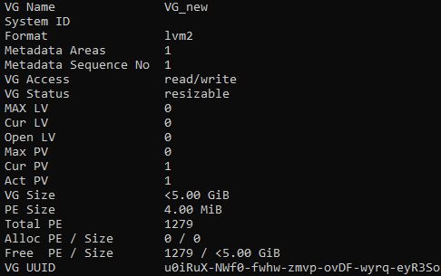
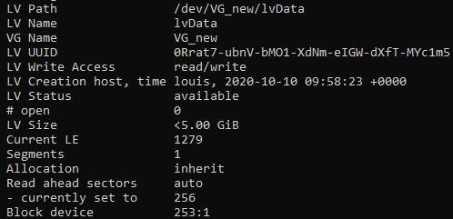
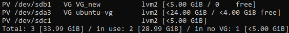

# TP 6 - Gestion des disques / Tâches d’administration (1)

## Exercice 1. Disques et partitions
1.  
2. **lsblk** permet de lister les périphériques en mode bloc  
3.
```bash
sudo fdisk /dev/sdb
n #new partition
p #primary partition
1 #first partition

+2G

n
p
2

t #modif type
7 #code hexa pour NTFS

w #pour sauvegarder
```
4.
```bash
sudo mkfs /dev/sdb1
sudo mkfs.ntfs /dev/sdb2
```
5. La commande **df -T** ne fonctionne pas sur notre disque car les partitions ne sont encore pas montées  
6. **sudo blkid** permet de rertourner des infos sur les partitions dont leurs UUID  
**sudo nano /etc/fstab** , résultat :
```bash
UUID=f7ad74e4-e163-4e40-bc9a-aa6b67e20458 etc/sdb1/data ext4 0 0 (ou) /dev/sdb1  /data ext4 defaults 0 0

UUID=2c8334aa-969c-4506-9070-6ff7d78ed549 etc/sdb2/win ntfs 0 0 (ou) /dev/sdb2 /win ntfs defaults 0 0
```
7.
```bash
sudo mount /dev/sdb1  /data
sudo mount /dev/sdb2  /win
sudo mount -a
```
8.
```bash
sudo mount /dev/sdc  /data1
cd /data1 
```
9.  
## Exercice 2. Partitionnement LVM

1. 
```bash
sudo umount /data1
sudo umount /data
sudo umount /win
sudo nano /etc/fstab
```
2. 
```bash
sudo fdisk /dev/sdb
d
1
d

n
p
1
8e
w
```
3. 
```bash
sudo pvcreate PV /dev/sdb1
pvdisplay
```
4. Il est préférable de le nommer **vg01** car c'est la premiere partition du disque  
```bash
sudo vgcreate VG_new /dev/sdb1
```


5. Le nom du volume s'appelle lvol0 ce qui est attendu est lvData, la commande **lvscan** permet de lister les les volume créer et après l'avoir supprimer on peut recréer, quant à l'option **-n** qui permet d'ajouter un nom 
```bash
sudo lvcreate -l 100%FREE VG_new
lvscan
sudo lvremove /dev/VG_new/lvol0
sudo lvcreate -l 100%FREE VG_new -n lvData
sudo lvdisplay
```
  
6. On commence par créer la partition puis on formate au format ext4 et on monte le nouveau LV
```bash
sudo fdisk /dev/mapper/VG_new-lvData
w

sudo mkfs.ext4 /dev/mapper/VG_new-lvData

sudo nano /etc/fstab
/dev/mapper/VG_new-lvData /data2 ext4 defaults 0 0  

sudo mkdir data2
sudo mount /dev/mapper/VG_new-lvData  /data2
sudo mount -a
df -T
```
7.**lsblk** le disque apparaît bien  
8.  
9.  
## Exercice 3. Exécution de commandes en différé : at et cron
2.
```bash
sudo fdisk /dev/sdc

t
8e
w
```
3.
```bash
sudo pvcreate PV_new2 /dev/sdc1
sudo pvscan
```
  
2. Non, il n'y a pas de service mail donc ça ne fonctionne pas  
3. **sudo nano etc/crontab**  
4.  
**sudo nano etc/crontab**  : journalier  
**/30 12 * * * echo "il faut réviser encore"**  :  annuel  
**/15 * * * * echo "il faut réviser encore tout les 15 min"**  :  15 min  
5. 
**sudo nano etc/crontab**
__*/5/2 18 * 1-15 * echo "il faut réviser encore les 1er et 15 du mois"__  
6.
**sudo nano etc/crontab**
__* 17 1-5 * * echo "il faut réviser encore les lundi au vendredi "__  
7. 
```bash
touch cronlog
sudo nano etc/crontab
*/3 * * * * echo "il faut réviser" >> /home/louis/cronlog
```


